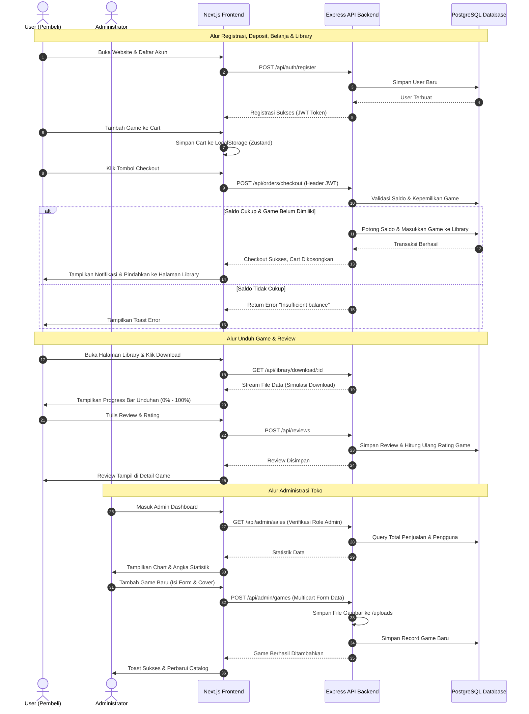

# Dokumentasi Aliran Aplikasi & Fitur Utama - Bust Webstore

Dokumen ini berisi penjelasan terperinci mengenai arsitektur sistem, fitur-fitur utama, alur kerja (app flow) pengguna, serta cetak biru antarmuka (*ASCII Wireframe*) untuk aplikasi **Bust**.

---

## 🎨 Arsitektur & Teknologi Utama

Bust dirancang menggunakan model arsitektur **Client-Server** monolitik terpisah (Decoupled):
* **Frontend**: Next.js 16 (App Router) & React 19 menggunakan TypeScript. Manajemen state dikelola secara ringkas dengan **Zustand** dan styling murni dengan **Vanilla CSS Variables** (tidak menggunakan Tailwind CSS).
* **Backend**: Express API Server menggunakan TypeScript, **Prisma ORM**, dan database relasional **PostgreSQL**.
* **Database & File System**: PostgreSQL dijalankan di dalam Docker container, sedangkan aset game dan gambar disimpan secara lokal di folder `uploads/` pada backend.

---

## ⚡ Fitur Utama (Core Features)

### 1. Sistem Autentikasi & Akun Pengguna
* **Registrasi & Login**: Keamanan enkripsi password menggunakan `bcryptjs` dan sesi dikelola dengan **JSON Web Tokens (JWT)** (Access & Refresh tokens).
* **Manajemen Saldo (Balance)**: Pengguna memiliki nominal saldo virtual yang digunakan untuk membeli game. Saldo dapat dikurangi saat transaksi checkout.
* **Role Management**: Terbagi menjadi **User** biasa dan **Admin**. Pengguna admin memiliki akses eksklusif ke rute administrasi.

### 2. Catalog & Discovery Game
* **Pencarian Real-time**: Fitur pencarian game berdasarkan judul.
* **Filter Kategori**: Mengelompokkan game berdasarkan kategori (misal: Action, RPG, Strategy, Indie, Adventure).
* **Detail Game & Media**: Deskripsi lengkap game beserta harga, rating bintang, rating rata-rata, dan review tertulis.

### 3. Persistensi Cart (Keranjang Belanja)
* Keranjang belanja disimpan secara aman di **Local Storage** (sinkronisasi Zustand) dan tetap tersimpan walaupun browser ditutup.
* Deteksi game duplikat untuk mencegah pembelian game yang sama.

### 4. Transaksi & Library Game
* **Sistem Checkout**: Memotong saldo pengguna dan memindahkan game dari Keranjang ke **Library (Perpustakaan Game)** pengguna secara permanen.
* **Library Dashboard**: Tempat pengguna melihat game yang sudah dibeli dan melakukan simulasi unduhan (*download progress bar* real-time).

### 5. Review & Rating System
* Pengguna dapat memberikan ulasan (review) teks serta rating bintang (1-5) pada game yang telah dibeli.
* Rating agregat (rata-rata) dihitung secara real-time di database.

### 6. Admin Panel (Dashboard & Management)
* **CRUD Database Game**: Tambah, edit, dan hapus catalog game secara dinamis.
* **Unggah File Gambar**: Terintegrasi dengan middleware `multer` untuk upload poster/cover game ke server.
* **Statistik Penjualan**: Laporan total pendapatan toko, total game terjual, dan jumlah pengguna terdaftar.

---

## 🔄 Alur Kerja Aplikasi (App Flow Chart)

Alur berikut menjelaskan siklus hidup pengguna dari kunjungan awal hingga mengunduh game, serta alur pengelolaan oleh admin.



---

## 📐 Tata Letak Antarmuka (Application Layout Wireframe)

Berikut adalah sketsa visual antarmuka (*layout*) dari halaman-halaman utama menggunakan format teks ASCII:

### 1. Halaman Store Utama (Home Page Layout)
```
+-------------------------------------------------------------------------------+
|  [Bust Logo]    [   Search Game...   ]      [Cart (3)]   [Tema ☀️/🌙] [Profile] |
+-------------------------------------------------------------------------------+
|                                                                               |
|  +-------------------------------------------------------------------------+  |
|  | [ Banner Image: Cyber Protocol ]                                        |  |
|  | Featured Game - Tactical Cyberpunk Puzzle Action                        |  |
|  |                                                         [ Buy - $19.99 ]|  |
|  +-------------------------------------------------------------------------+  |
|                                                                               |
|  Kategori: [ Semua ] [ Action ] [ RPG ] [ Strategy ] [ Indie ] [ Adventure ]  |
|                                                                               |
|  +--------------------+  +--------------------+  +--------------------+       |
|  | [Cover Image]      |  | [Cover Image]      |  | [Cover Image]      |       |
|  | Cyber Protocol     |  | Space Ranger       |  | Starlight Odyssey  |       |
|  | Action | ★★★★☆      |  | RPG | ★★★★★        |  | Indie | ★★★☆☆      |       |
|  | Price: $19.99      |  | Price: $14.99      |  | Price: Free        |       |
|  | [ Add to Cart ]    |  | [ Add to Cart ]    |  | [ Add to Cart ]    |       |
|  +--------------------+  +--------------------+  +--------------------+       |
|                                                                               |
+-------------------------------------------------------------------------------+
|                                                             © 2026 Bust Store |
+-------------------------------------------------------------------------------+
```

### 2. Halaman Detail Game (Game Detail Layout)
```
+-------------------------------------------------------------------------------+
|  [Bust Logo]    [   Search Game...   ]                   [Cart (3)] [Profile] |
+-------------------------------------------------------------------------------+
|  [ <-- Kembali ke Toko ]                                                      |
|                                                                               |
|  +-----------------------------------+   Cyber Protocol                       |
|  |                                   |   Kategori : Action                    |
|  |                                   |   Rating   : ★★★★☆ (4.5 / 5)            |
|  |        [ Game Screenshot /        |   Harga    : $19.99                    |
|  |          Promo Graphic ]          |   ----------------------------------   |
|  |                                   |   [ Tambah ke Keranjang🛒 ]            |
|  |                                   |                                        |
|  +-----------------------------------+   [ Beli Sekarang ⚡ ]                  |
|                                                                               |
|  Deskripsi Game:                                                              |
|  Cyber Protocol adalah game puzzle aksi bernuansa cyberpunk taktis yang cepat. |
|  Hack sistem keamanan, kalahkan firewall, dan temukan rahasianya!            |
|                                                                               |
|  Ulasan Pengguna:                                                             |
|  +-------------------------------------------------------------------------+  |
|  | Tulis Ulasan Anda: [ ★★★★★ ] [ Kolom komentar tertulis...            ]  |
|  | [ Kirim Ulasan ]                                                        |  |
|  +-------------------------------------------------------------------------+  |
|  * User123 (★★★★★): "Mekanik puzzle yang sangat menantang dan musiknya keren!" |
|  * GamerX9 (★★★★☆): "Grafisnya luar biasa, tapi tingkat kesulitannya tinggi." |
+-------------------------------------------------------------------------------+
```

### 3. Halaman Library & Progress Download (User Library Layout)
```
+-------------------------------------------------------------------------------+
|  [Bust Logo]                                            [Saldo: $150] [Profile] |
+-------------------------------------------------------------------------------+
|  ## Library Game Anda                                                         |
|  Di sini adalah daftar game digital yang telah Anda beli dan siap dimainkan.  |
|                                                                               |
|  +-------------------+  +-------------------+  +--------------------+         |
|  | [Cover Image]     |  | [Cover Image]     |  | [Cover Image]      |         |
|  | Cyber Protocol    |  | Space Ranger      |  | Starlight Odyssey  |         |
|  |                   |  |                   |  |                    |         |
|  | [ Unduh Game 📥 ] |  | [ Siap Dimainkan ]|  | [Downloading... 📥]|         |
|  |                   |  |                   |  | [████░░░░░░] 40%   |         |
|  +-------------------+  +-------------------+  +--------------------+         |
+-------------------------------------------------------------------------------+
```

### 4. Dashboard Administrasi (Admin Panel Layout)
```
+-------------------------------------------------------------------------------+
|  [Bust Admin]    Dashboard  |  Kelola Game  |  Transaksi          [Keluar 🚪] |
+-------------------------------------------------------------------------------+
|  ## Statistik Toko                                                            |
|  +--------------------+  +--------------------+  +--------------------+       |
|  | Pendapatan Kotor   |  | Game Terjual       |  | Pengguna Terdaftar |       |
|  | $1,450.80          |  | 73 Kopi            |  | 14 User            |       |
|  +--------------------+  +--------------------+  +--------------------+       |
|                                                                               |
|  ## Kelola Database Game                                  [ + Tambah Game ]   |
|  +-------------------------------------------------------------------------+  |
|  | Judul            | Kategori  | Harga   | Rating   | Aksi                |  |
|  +-------------------------------------------------------------------------+  |
|  | Cyber Protocol   | Action    | $19.99  | 4.5/5    | [Edit ✏️] [Hapus ❌] |  |
|  | Space Ranger     | RPG       | $14.99  | 5.0/5    | [Edit ✏️] [Hapus ❌] |  |
|  +-------------------------------------------------------------------------+  |
+-------------------------------------------------------------------------------+
```
