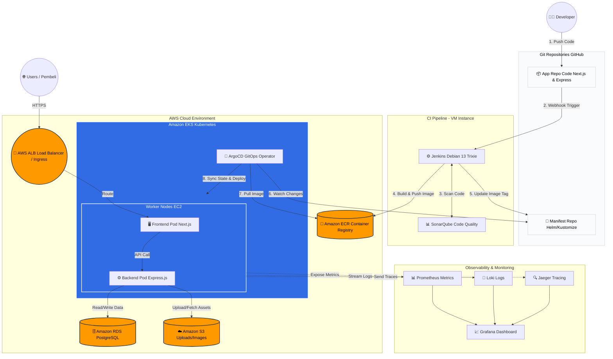

```mermaid
flowchart TD
    %% Define external actors
    Dev((🧑‍💻 Developer))
    Users((🌐 Users / Pembeli))

    %% Version Control
    subgraph Repos [Git Repositories GitHub]
        direction TB
        AppRepo[📦 App Repo Code Next.js & Express]
        ManRepo[📜 Manifest Repo Helm/Kustomize]
    end

    %% CI Pipeline
    subgraph CI [CI Pipeline - VM Instance]
        direction TB
        J[⚙️ Jenkins Debian 13 Trixie]
        SQ[📊 SonarQube Code Quality]
    end

    %% AWS Cloud Environment
    subgraph AWS [AWS Cloud Environment]
        direction TB
        
        ECR[(🐳 Amazon ECR Container Registry)]
        ALB((🚦 AWS ALB Load Balancer / Ingress))
        
        subgraph EKS [Amazon EKS Kubernetes]
            Argo[🐙 ArgoCD GitOps Operator]
            
            subgraph Nodes [Worker Nodes EC2]
                FE[🖥️ Frontend Pod Next.js]
                BE[⚙️ Backend Pod Express.js]
            end
        end

        RDS[(🗄️ Amazon RDS PostgreSQL)]
        S3[(☁️ Amazon S3 Uploads/Images)]
    end

    %% Observability Stack
    subgraph Obs [Observability & Monitoring]
        direction LR
        Graf[📈 Grafana Dashboard]
        Prom[📊 Prometheus Metrics]
        Loki[📝 Loki Logs]
        Jaeger[🔍 Jaeger Tracing]
        
        Prom --> Graf
        Loki --> Graf
        Jaeger --> Graf
    end

    %% --- Workflow Connections ---

    %% Developer to Repo
    Dev -->|1. Push Code| AppRepo

    %% CI Flow
    AppRepo -->|2. Webhook Trigger| J
    J <-->|3. Scan Code| SQ
    J -->|4. Build & Push Image| ECR
    J -->|5. Update Image Tag| ManRepo

    %% CD Flow (GitOps)
    Argo -->|6. Watch Changes| ManRepo
    Argo -->|7. Pull Image| ECR
    Argo -->|8. Sync State & Deploy| Nodes

    %% User Traffic
    Users -->|HTTPS| ALB
    ALB -->|Route| FE
    FE -->|API Call| BE

    %% Database & Storage
    BE -->|Read/Write Data| RDS
    BE -->|Upload/Fetch Assets| S3

    %% Telemetry
    Nodes -.->|Expose Metrics| Prom
    Nodes -.->|Stream Logs| Loki
    Nodes -.->|Send Traces| Jaeger

    classDef aws fill:#FF9900,stroke:#232F3E,stroke-width:2px,color:black;
    classDef git fill:#fafbfc,stroke:#e1e4e8,stroke-width:2px,color:black;
    classDef k8s fill:#326ce5,stroke:#fff,stroke-width:2px,color:white;
    
    class EKS,Nodes k8s;
    class ECR,ALB,RDS,S3 aws;
    class Repos,AppRepo,ManRepo git;
```